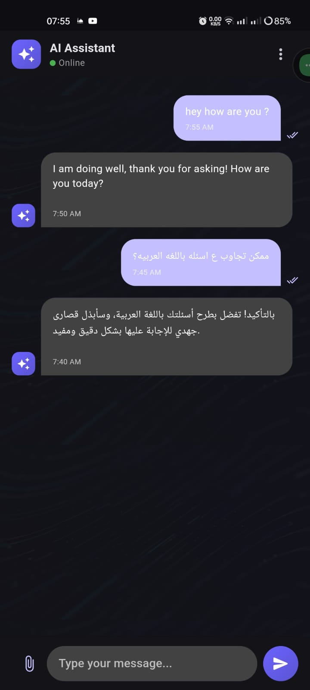

# AI Chat App UI

A modern Flutter AI chat application interface with a clean MVVM architecture.

 |  | 
---|---|---

## Features

- Clean MVVM architecture for separation of concerns
- Beautiful UI with Material Design 3 principles
- Light and dark theme support
- Animated typing indicator
- Message bubbles with timestamps and read receipts
- Responsive layout

## Project Structure

```
lib/
├── main.dart
├── model/
│   └── message.dart
├── services/
│   └── ai_service.dart
├── view/
│   ├── screens/
│   │   └── chat_screen.dart
│   └── widgets/
│       ├── chat_app_bar.dart
│       ├── chat_input.dart
│       ├── message_bubble.dart
│       ├── message_list.dart
│       └── typing_indicator.dart
└── viewmodel/
    └── chat_viewmodel.dart
```

## Getting Started

1. Ensure you have Flutter installed on your machine
2. Clone this repository
3. Run `flutter pub get` to install dependencies
4. Run the app with `flutter run`

## Dependencies

- provider: For MVVM state management
- intl: For date formatting

## Note

This is a UI-only implementation. To make it functional, you'll need to:

1. Implement the API calls in `ai_service.dart`
2. Complete the business logic in `chat_viewmodel.dart`
3. Connect the UI to the ViewModel using Provider

Getting start :-
``` bash
git clone https://github.com/sayedyounis00/Ai-chaty.git
